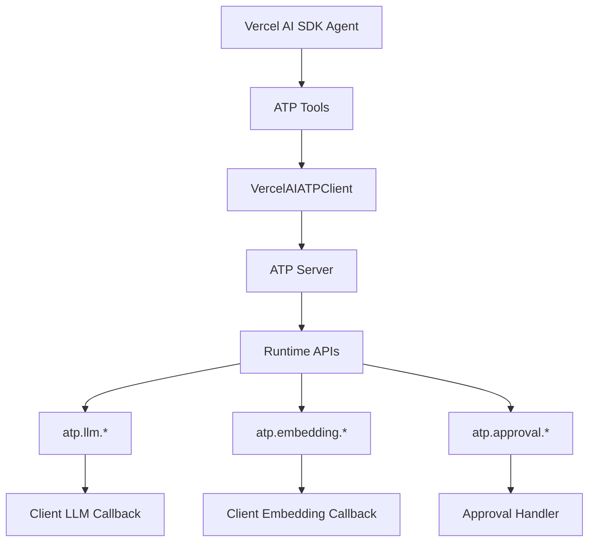

# @mondaydotcomorg/atp-vercel-ai-sdk

Vercel AI SDK integration for Agent Tool Protocol with production-ready features.

## Overview

This package integrates ATP with Vercel AI SDK, enabling agents to generate and execute ATP code as tools. Includes support for human-in-the-loop approvals, LLM sampling, and embeddings.

## Installation

```bash
npm install @mondaydotcomorg/atp-vercel-ai-sdk ai @ai-sdk/openai
```

## Architecture



## Features

- 🤖 **Vercel AI SDK Tools** - Use ATP as tools with `generateText` and `streamText`
- 🔄 **Multi-Step Execution** - Full integration with Vercel AI SDK's `maxSteps` parameter
- 🧠 **LLM Sampling** - `atp.llm.call()` routes to your Vercel AI SDK model
- 🔍 **Embedding Support** - `atp.embedding.*` routes to your embeddings model
- ✅ **Approval Workflows** - Human-in-the-loop via async callbacks
- 📡 **Streaming Support** - Works with both `generateText` and `streamText`
- 📝 **TypeScript** - Full type safety

## Quick Start

### Basic Agent with Tools

```typescript
import { createATPTools } from '@mondaydotcomorg/atp-vercel-ai-sdk';
import { openai } from '@ai-sdk/openai';
import { generateText } from 'ai';

const model = openai('gpt-4o');

const { tools } = await createATPTools({
	serverUrl: 'http://localhost:3333',
	headers: { Authorization: 'Bearer your-api-key' },
	model,
	approvalHandler: async (message, context) => {
		console.log('Approval needed:', message);
		return true;
	},
});

const result = await generateText({
	model,
	system: 'You can execute TypeScript code using ATP tools',
	prompt: 'Use ATP to call an LLM and get a creative product idea',
	tools,
	maxSteps: 5,
});
```

### With Streaming

```typescript
import { createATPTools } from '@mondaydotcomorg/atp-vercel-ai-sdk';
import { openai } from '@ai-sdk/openai';
import { streamText } from 'ai';

const model = openai('gpt-4o');

const { tools } = await createATPTools({
	serverUrl: 'http://localhost:3333',
	headers: { Authorization: 'Bearer your-api-key' },
	model,
	approvalHandler: async () => true,
});

const result = await streamText({
	model,
	prompt: 'Use ATP to generate code',
	tools,
	maxSteps: 5,
});

for await (const chunk of result.textStream) {
	process.stdout.write(chunk);
}
```

### With Embeddings

```typescript
import { createATPTools } from '@mondaydotcomorg/atp-vercel-ai-sdk';
import { openai } from '@ai-sdk/openai';
import { embed } from 'ai';

const model = openai('gpt-4o');

const embeddings = {
	embed: async (text: string) => {
		const result = await embed({
			model: openai.embedding('text-embedding-3-small'),
			value: text,
		});
		return result.embedding;
	},
};

const { tools } = await createATPTools({
	serverUrl: 'http://localhost:3333',
	headers: { Authorization: 'Bearer your-api-key' },
	model,
	embeddings,
});

// Agent can now use atp.embedding.embed() in code
```

## How It Works

### ATP Runtime in Vercel AI SDK

When agents use ATP tools, they can generate TypeScript code using ATP's runtime APIs:

```typescript
// Agent generates this code:
const idea = await atp.llm.call({
	prompt: 'Generate a product idea',
});

// Store embedding for semantic search
const embeddingId = await atp.embedding.embed(idea);

// Request approval
const approval = await atp.approval.request(`Launch product: ${idea}?`, { idea });

if (approval.approved) {
	return await atp.llm.call({
		prompt: `Create marketing copy for: ${idea}`,
	});
}
```

### LLM Sampling

`atp.llm.call()` routes to your Vercel AI SDK model:

- Uses the same model as your agent
- Fresh context for sub-reasoning
- Supports `call()`, `extract()`, `classify()`

```typescript
// In ATP code:
const analysis = await atp.llm.call({
	prompt: 'Analyze this data: ' + JSON.stringify(data),
	temperature: 0.7,
});

// Structured extraction
const structured = await atp.llm.extract({
	prompt: 'Extract key information',
	schema: z.object({
		name: z.string(),
		age: z.number(),
	}),
});
```

### Approval Mechanism

When ATP code calls `atp.approval.request()`, your async handler is invoked:

```typescript
const { tools } = await createATPTools({
	serverUrl: 'http://localhost:3333',
	headers: { Authorization: 'Bearer your-api-key' },
	model,
	approvalHandler: async (message, context) => {
		// Option 1: CLI prompt
		return confirm(message);

		// Option 2: Webhook notification
		await sendSlackNotification(message);
		return await waitForWebhookResponse();

		// Option 3: Database queue
		await db.approvals.create({ message, context });
		return await pollForApproval();
	},
});
```

## API Reference

### createATPTools()

```typescript
async function createATPTools(options: CreateATPToolsOptions): Promise<ATPToolsResult>;
```

**Options:**

```typescript
interface CreateATPToolsOptions {
	serverUrl: string;
	headers?: Record<string, string>;
	model: any;
	embeddings?: EmbeddingProvider;
	approvalHandler?: ApprovalHandler;
	defaultExecutionConfig?: Partial<ExecutionConfig>;
	hooks?: ClientHooks;
}
```

**Returns:**

```typescript
interface ATPToolsResult {
	client: VercelAIATPClient;
	tools: Record<string, any>;
}
```

### VercelAIATPClient

```typescript
class VercelAIATPClient {
	execute(code: string, config?: ExecutionConfig): Promise<ExecutionResult>;
	getTypeDefinitions(): string;
	getUnderlyingClient(): AgentToolProtocolClient;
}
```

## Production Patterns

### Webhook-Based Approval

```typescript
const pendingApprovals = new Map();

const approvalHandler = async (message: string, context?: any) => {
	const approvalId = generateId();

	await db.approvals.create({
		id: approvalId,
		message,
		context,
		status: 'pending',
	});

	await sendSlackNotification({
		channel: '#approvals',
		text: message,
		actions: [
			{ type: 'button', text: 'Approve', action_id: `approve_${approvalId}` },
			{ type: 'button', text: 'Deny', action_id: `deny_${approvalId}` },
		],
	});

	return new Promise((resolve) => {
		pendingApprovals.set(approvalId, resolve);
		setTimeout(() => {
			pendingApprovals.delete(approvalId);
			resolve(false);
		}, 300000);
	});
};

app.post('/slack/actions', async (req, res) => {
	const { action_id } = req.body;
	const approvalId = action_id.replace(/^(approve|deny)_/, '');
	const approved = action_id.startsWith('approve');

	const resolve = pendingApprovals.get(approvalId);
	if (resolve) {
		resolve(approved);
		pendingApprovals.delete(approvalId);
	}

	res.json({ ok: true });
});
```

### Multiple Sequential Approvals

```typescript
// Agent generates ATP code with multiple approvals:
const step1 = await atp.approval.request('Approve step 1?');
if (!step1.approved) return { cancelled: true };

const step2 = await atp.approval.request('Approve step 2?');
if (!step2.approved) return { cancelled: true };

return { success: true };
```

Each `atp.approval.request()` triggers your approval handler.

### Error Handling

```typescript
const { tools } = await createATPTools({
	serverUrl: 'http://localhost:3333',
	headers: { Authorization: 'Bearer your-api-key' },
	model,
	approvalHandler: async (message) => {
		try {
			return await requestApproval(message);
		} catch (error) {
			console.error('Approval error:', error);
			return false;
		}
	},
});
```

## Comparison with LangChain Integration

| Feature                  | Vercel AI SDK       | LangChain               |
| ------------------------ | ------------------- | ----------------------- |
| Tool Format              | `tool()` function   | Tool classes            |
| Agent Type               | ToolLoopAgent       | ReActAgent              |
| Approval Mechanism       | Async callbacks     | Interrupts + Checkpoints|
| State Persistence        | Custom              | Built-in (LangGraph)    |
| Streaming                | Native support      | Via LangChain           |
| Model Integration        | `generateText`      | `ChatModel.invoke`      |

## Examples

See [`examples/vercel-ai-sdk-example/`](../../examples/vercel-ai-sdk-example/):

- **`agent.ts`** - Basic ToolLoopAgent with CLI approvals
- **`streaming.ts`** - Streaming responses with ATP tools
- **`webhook-approval.ts`** - Production webhook-based approvals

### RAG with Embeddings

```typescript
import { createATPTools } from '@mondaydotcomorg/atp-vercel-ai-sdk';
import { openai } from '@ai-sdk/openai';
import { embed } from 'ai';

const model = openai('gpt-4o');

const embeddings = {
	embed: async (text: string) => {
		const result = await embed({
			model: openai.embedding('text-embedding-3-small'),
			value: text,
		});
		return result.embedding;
	},
};

const { tools } = await createATPTools({
	serverUrl: 'http://localhost:3333',
	headers: { Authorization: 'Bearer your-api-key' },
	model,
	embeddings,
});

const result = await generateText({
	model,
	tools,
	maxSteps: 5,
	prompt: `Use ATP to:
    1. Embed these documents: ["AI is...", "ML is...", "DL is..."]
    2. Search for content similar to "neural networks"
    3. Use atp.llm.call() to answer based on results`,
});
```

## TypeScript Support

```typescript
import type {
	VercelAIATPClient,
	VercelAIATPClientOptions,
	ApprovalRequest,
	ApprovalResponse,
	ApprovalHandler,
	CreateATPToolsOptions,
	ATPToolsResult,
	EmbeddingProvider,
} from '@mondaydotcomorg/atp-vercel-ai-sdk';
```

## Requirements

- Node.js 18+
- TypeScript 5.0+
- `ai` ^4.0.0
- Vercel AI SDK provider (e.g., `@ai-sdk/openai`)

## License

MIT

## Learn More

- [ATP Documentation](../../README.md)
- [Vercel AI SDK Documentation](https://sdk.vercel.ai/docs)
- [Examples](../../examples/vercel-ai-sdk-example/)

